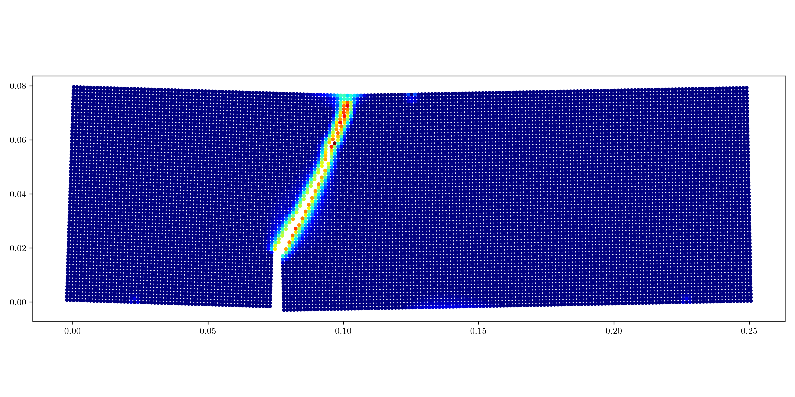
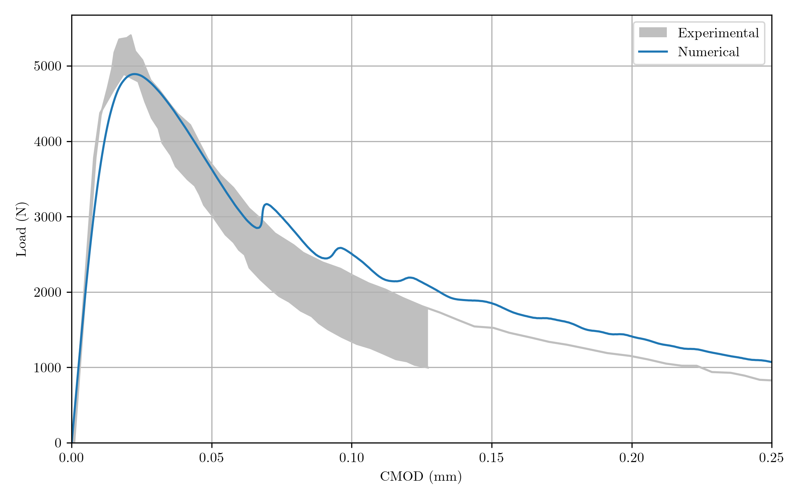
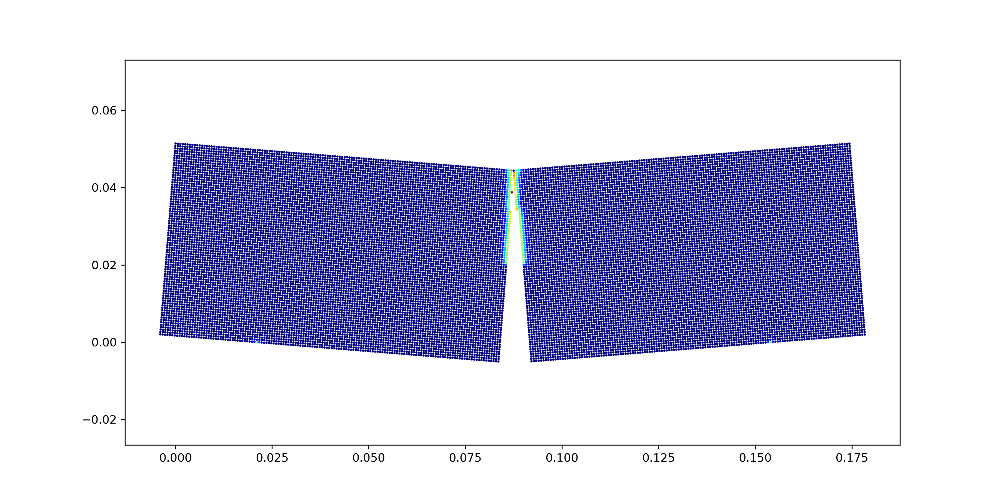

# pypd

A simple and performant Python implementation of the bond-based peridynamic model. `pypd` offers an intuitive class structure with fully interchangeable material models and integration schemes.

### Features:
- **Pure Python:** Written entirely in Python, leveraging the power of [Numba](https://numba.pydata.org/) for optimal performance
- **Material Models:** Seamlessly switch between various material models including linear, trilinear, and nonlinear
- **Integration schemes:** Fully interchangeable integration schemes
- **Examples:** Several examples are provided and validated using published experimental data

## Usage

**Explore examples using `pypd` in Google Colab**

| Example description | Notebook |
| ------- | -------- |
| Crack branching in Homalite |  <a href="https://colab.research.google.com/github/mark-hobbs/pypd/blob/main/examples/crack_branching.ipynb" target="_parent"></a> |
| Half-notched quasi-brittle beam in three-point bending | <a href="https://colab.research.google.com/github/mark-hobbs/pypd/blob/main/examples/half_notched_beam.ipynb" target="_parent"></a> |
| Plate with a hole under tension | <a href="https://colab.research.google.com/github/mark-hobbs/pypd/blob/main/examples/plate_with_hole.ipynb" target="_parent"></a> |

## Getting started

Development version from GitHub:

```shell
$ pip install git+https://github.com/mark-hobbs/pypd.git
```

or for contributors using [Pipenv](https://pipenv.pypa.io/en/latest/):


```shell
$ git clone https://github.com/mark-hobbs/pypd.git
$ cd pypd/
$ pipenv install --dev
$ pipenv shell
```

## Dependencies

- NumPy
- Numba
- scikit-learn
- Matplotlib
- tqdm

**Development dependencies**

- Black
- Ruff
- Jupyter

## Code structure

## Examples

<details>

<summary>Expand for a summary of the examples provided</summary>

There are multiple examples provided:

- [Crack branching in notched Homalite sheets](/examples/crack_branching.py)
- [Plate with a hole in tension](/examples/plate_with_hole.py)
- [Three-point bending test of a half-notched concrete beam](/examples/half_notched_beam.py)
- [Nuclear graphite ring compression test  ](/examples/graphite_ring.py)
- [Mixed-mode fracture in concrete](/examples/mixed_mode_fracture.py)

### Crack branching

```
python -m examples.2D_notch.py
```


### Mixed-mode fracture

Example with validation using experimental data. 

<span style="font-family: 'Courier New', monospace;"> García-Álvarez, V. O., Gettu, R., and Carol, I. (2012). Analysis of mixed-mode fracture in concrete using interface elements and a cohesive crack model. Sadhana, 37(1):187–205.</span>





### Flexural three-point bending test - half-notched beam

```
python -m examples.2D_B4_HN.py
```



</details>

## :white_check_mark: TODO

- [ ] Write unit tests
- [ ] Write documentation
- [ ] Publish on PyPI
- [ ] `feature/space-filling-curve` - sort particles spatially to improve memory access (see this [notebook](https://github.com/pdebuyl/compute/blob/master/hilbert_curve/hilbert_curve.ipynb) on understanding the Hilbert curve)
- [x] `feature/animation` - add native capabilities to generate animations
- [ ] GPU acceleration (see this [notebook](https://github.com/lukepolson/youtube_channel/blob/main/Python%20GPU/multibody_boltzmann.ipynb) where `pytorch` is used to speed up particle simulations)
- [ ] Implement a volume correction scheme to improve spatial integration accuracy
- [x] Implement a surface correction scheme to correct the peridynamic surface effect
- [x] Implement different influence functions (constant/triangular/quartic)
- [ ] Separate model and simulation logic: `simulation.run(model)`